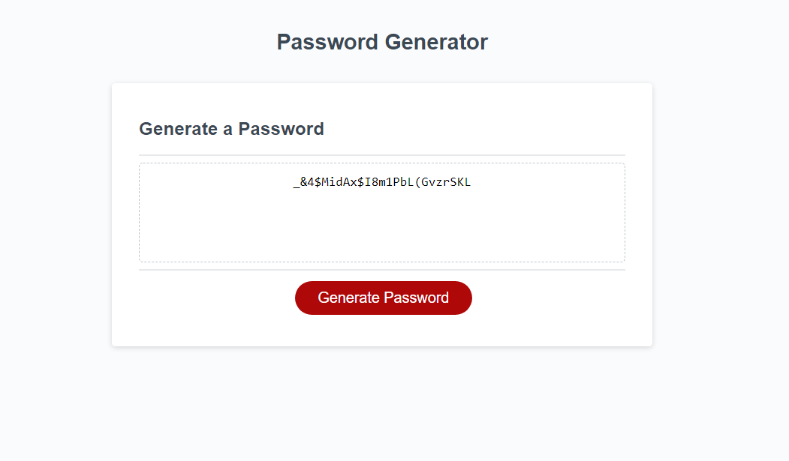

# 📔 Password-Generator

A website made using HTML, CSS, & JS with the purpose of generating a random string of characters that could be used as a secure password.

# Features:

- Asks user for desired password length between 8-128 characters
- Asks user if they want to include lowercase characters, uppercase characters, numbers, or symbols
- Random characters will be chosen from selection
- Password will be generated and displayed on page

# 📑 [Deployed Website](https://wratten.github.io/Password-Generator/)

!
